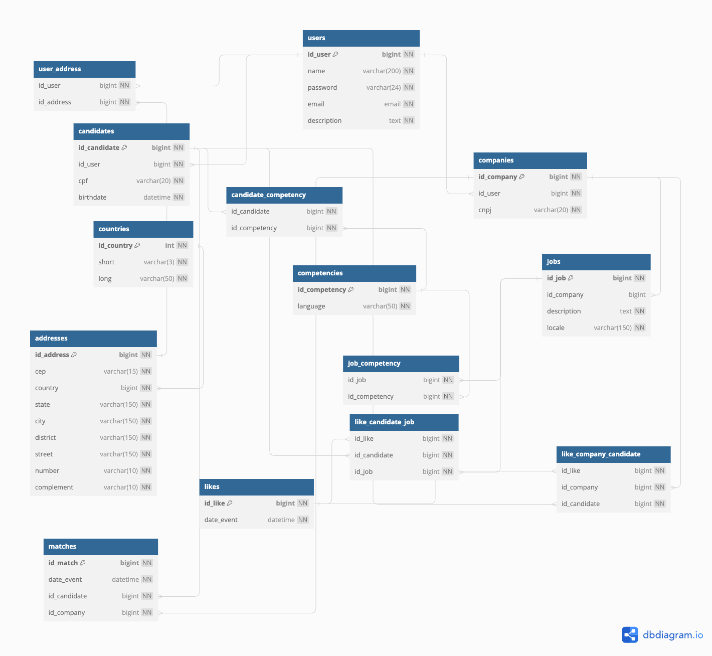

# Acelera ZG 4

## ZG-HERO Project
<p>Desenvolvido por: <b>Vinícius Vianna</b></p>

***

# :student::heart_on_fire::office_worker: Linketinder

## :question: O que é?
O Linketinder é um aplicativo que conecta **candidatos** em busca de vagas com **empresas** em busca do trabalhador ideal para
suas necessidades.

> As atuais soluções para amenizar esse problema são o Linkedin ou empresas especializadas em treinamento/contratação,
> por exemplo, DIO. Porém, essas soluções não são práticas o suficiente, reúnem diversas funcionalidades, mas retornam
> dados tendenciosos, influenciados por perfis mais curtidos pessoas que utilizam palavras chaves com mais destaque, dificultando, por vezes, a filtragem de perfis com potencial, porém sem muito destaque.
> 
> --<cite>Dr Antônio Paçoca</cite>

O objetivo do Linketinder é unir o propósito do :blue_book:Linkedin e do :fire:Tinder para criar um método dinâmico,
rápido e eficaz de conectar diretamente candidatos e empresas, baseado apenas nos requisitos da vaga e nas competências
do candidato.

---
> Veja uma vaga > *Swipe right* > Se a empresa gostar de você, um ***match*** acontece > Converse com a empresa > Encontre seu emprego 
---

## :newspaper: O que está planejado?
- Fazer cadastro como candidato ou empresa, com a lista de competências ofertadas / desejadas :heavy_check_mark:
- Como empresa: postar vagas
- Como candidato: ver lista de vagas nos models dos perfis do Tinder
- Como empresa: ver lista de candidatos nos moldes dos perfis do Tinder
- Dar o :+1:**Like** e formar um :heart_on_fire:**Match**
- Estabelecer comunicação entre a empresa e o candidato quando o match acontecer (e-mail)
- Chat interno

## :gear: Como utilizar?

### Back-end

Para o projeto da trilha K1-T4, era necessário apenas listar os candidatos e empresas cadastrados e, opcionalmente,
fazer cadastro de novos usuários. Para tal, basta clonar o repositório, buildar na sua IDE e rodar o arquivo `Main.groovy`
que se encontra na pasta `src`.

Na primeira vez que rodar o projeto, dois scripts gerarão arquivos `json` para candidatos e empresas, que servirão como
base de dados. Os scripts também geram 5 candidatos e empresas aleatórios pré-cadastrados como foi pedido no enunciado.

### Front-end

Para visualizar um preview do frontend, certifique-se de ter o node e o npm instalados. Depois basta entrar na pasta frontend e seguir os passos no terminal:

```bash
npm install
npm run preview
```

Um servidor de desenvolvimento do webpack será levantado na porta 8080. Se for a primeira vez rodando o site (ou se o localstorage estiver zerado) você será redirecionado para a página de Login. Você pode então clicar em "Não tem uma conta?" para fazer o cadastro de um candidato ou empresa novos.

### Banco de Dados

Ainda não há integração entre o banco de dados e a aplicação em si, mas você pode observar o Diagrama Entidade-Relacionamento aqui:



E gerar o banco de dados inicial, com cinco inserts de usuários e empresas, além de algumas vagas, likes e um match. O arquivo `Linketinder.sql` se encontra na pasta raiz do projeto e está adequado para o Postgresql (testado na versão 16). Se você usa uma interface gráfica de gerenciamento de database, basta rodar o script na sua ferramenta. Caso use o Postgresql no terminal via psql, tente rodar `psql -d linketinder < Linketinder.sql` com a database *linketinder* já criada. No Linux pode ser necessário configurar o usuário padrão, mas se você usa psql você, provavelmente, já sabe disso :smile:.


## :space_invader: Bug fixes

- Nada aqui por enquanto.

## :computer: Tecnologias e Frameworks utilizados

### Back-end
- Groovy (v4.0.14)

### Front-end
- HTML
- CSS
- JS
- TypeScript

### Frameworks e bibliotecas
- Webpack
- Chart.js

### Banco de Ddados
- Postgresql
- dbdiagram.io

O DER e toda a modelagem do banco de dados foi feita no [dbdiagram.io](https://dbdiagram.io/home). Se você não conhece, vale a pena dar uma olhada. A ferramenta permite criar as entidades e as relações entre elas a partir de objetos semelhantes a um JSON, além de exportar o resultado em forma de imagem e script sql.
***

## Sobre o Groovy


Groovy é uma linguagem que roda na **JVM** e utiliza as ferramentas que o :coffee:Java oferece, mas expande em cima delas
criando uma sintaxe simples, concisa e que disponibiliza diversos atalhos e objetos robustos para simplificar a vida do
desenvolvedor.

Esta é uma linguagem que eu não tinha nenhum conhecimento e fiquei encantado em como ela permite uma liberdade enorme para
o programador ao mesmo tempo que cria um ambiente amigável com diversas ferramentas que simplificam muito o nosso trabalho,
como os *builders*. Além disso, poder trabalhar com *closures* e com um paradigma mais funcional, mesmo dentro da POO, é um
diferencial para mim.

Como um dev que mexeu com Python durante todo o início do meu aprendizado, me senti em casa com algumas das implementações
do Groovy, mas ela ainda traz outros conceitos para a mesa que deixam tudo mais interessante.

Se assim como eu você não conhecia Groovy e ficou interessado, pode encontrar tudo que precisa [aqui](https://groovy-lang.org/index.html).